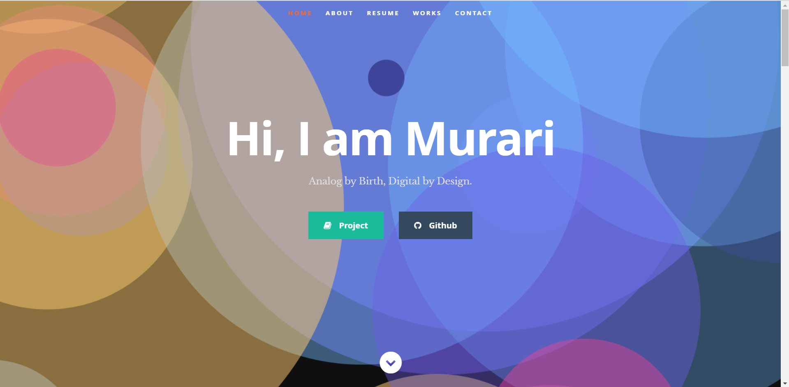

# Murari_portfolio    

### DEMO is [here](https://murarikumar42.github.io/myportfolio)



# About [`particles-bg`](https://github.com/lindelof/particles-bg) library
#### This project uses the react particle background component library [https://github.com/lindelof/particles-bg](https://github.com/lindelof/particles-bg). It's very simple. Anyone can be a Musketeer with it.


## Run Project
### 1. Clone the project

### 2. Run the project
```shell
npm i
npm start
```

### 3. BUild
```shell
npm run build
```
